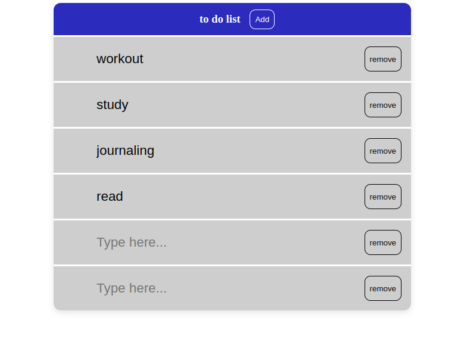

# 📝 To-Do List Web App

This is a simple and responsive to-do list web application built using **HTML**, **CSS**, and **JavaScript**.  
It allows users to dynamically add and remove tasks, and stores the data in the browser using **localStorage** for persistence.

---

## 🚀 Features

- Add new tasks with a single click
- Edit tasks directly in the list
- Remove tasks instantly
- Automatically saves data to localStorage
- Loads saved tasks on page reload
- Responsive and clean UI

---

## 💡 How It Works

- Clicking the **Add** button creates a new list item with an input and a remove button.
- Changes are saved in real time using `localStorage.setItem`.
- When the page is reloaded, previously saved tasks are restored.

---

## 📁 Files

- `index.html` → Contains the page structure and main button
- `style.css` → Styles the to-do list, buttons, inputs, and layout
- `script.js` → Handles all the dynamic logic (adding/removing/saving tasks)

---

## 🛠️ Tech Stack

- HTML5
- CSS3
- JavaScript (Vanilla)

---

## 📷 Preview

  

---

## 📌 Note

This is a beginner-friendly project and was made for learning purposes.  
Suggestions or contributions are welcome!

---

## 🧑‍💻 Author

Made by [Gabriele]  
GitHub: [Gabriel08Mosc](https://github.com/Gabriel08Mosc)
